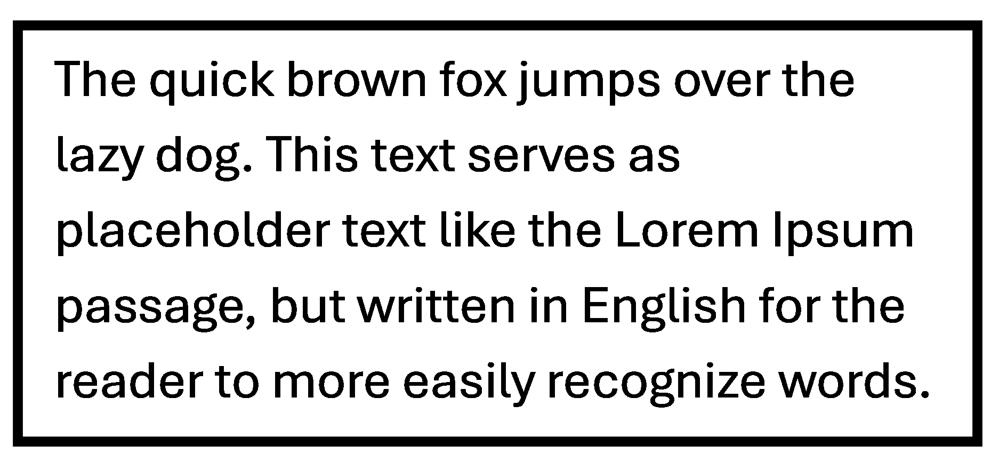
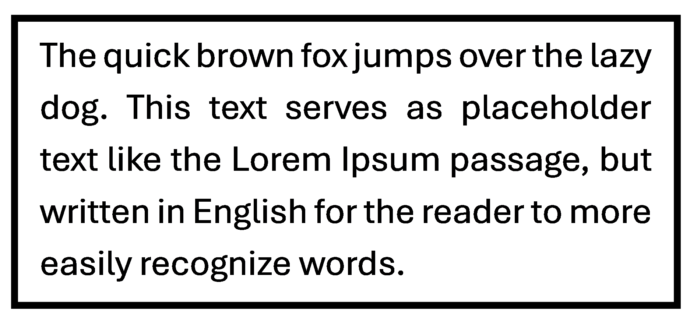

# Boustrophedon Chrome Extension

The goal is to make reading pages easier line-by-line, as your eyes don't need to dart from the right end of the page at the previous line back to the left at the start of the next line.

It is named after the ancient Greek term for this writing method ['boustrophedon,'](https://en.wikipedia.org/wiki/Boustrophedon) which literally translating to "as the ox plows."

Renders LTR page text in the boustrophedon style.

- Line 1 reads left-to-right
- Line 2 reads right-to-left
- Line 3 reads left-to-right
- ... and so on

## Implemented methods

- Method 1: Word order reversal. Flips the order of words in a line, like "the quick brown fox" -> "fox brown quick the"
- Method 2: Letter order reversal. Flips the order of letters in a word, like "tell her no" -> "llet reh on"
- Method 3: Character mirroring (not developed yet). Flips individual glyphs, like R -> Я.

With these three independent methods enabled, the extension achieves true boustrophedon text. However, as word order reversal is the easiest and most readable choice, it is the only method enabled by default.

## Additional notes

Having Boustrophedon mode enabled automatically applies [justification](https://en.wikipedia.org/wiki/Typographic_alignment#Examples) to text:

| Unjustified | Justified |
| :---------: | :---------: |
|  |  |

Note that this extension only affects the appearance of the text, as copying & pasting places the original text onto your clipboard.

Use the following keyboard shortcuts to toggle the global on/off state of the extension's functionality:
- `Ctrl+B` (Windows/Linux)
- `Command+B` (macOS)

## Testing local sample pages

If you test with files from `assets/samples`, use `sample-page.html` (or any normal `.html` file).

Chrome blocks script execution in `.mhtml`/`.mht` documents because they are loaded in a sandboxed frame without `allow-scripts`. That restriction also prevents extension content scripts from running there.

To test local files in Chrome extensions:
- Open `chrome://extensions`
- Enable **Developer mode**
- Open this extension's **Details**
- Turn on **Allow access to file URLs**